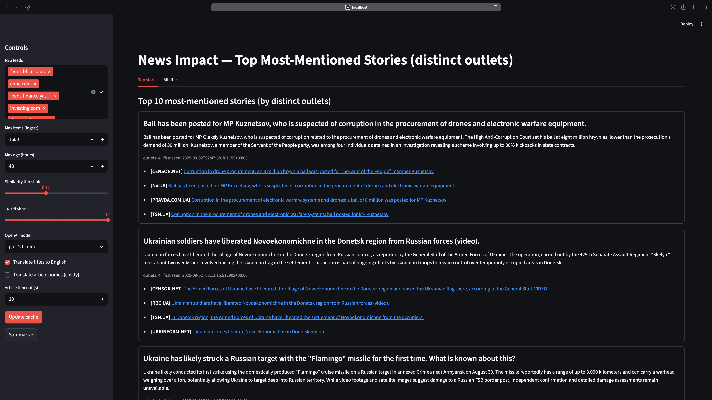

# News Impact — агрегатор найчастіше згаданих новин (GenAI)



## Вступ
**Мета:** зменшити інфошум і дати стислий, нейтральний огляд ключових сюжетів, які одночасно висвітлюють різні ЗМІ.  
**Ідея:** об’єднати RSS/Atom заголовки з багатьох видань, перекласти для уніфікації, виконати семантичне групування та сформувати **Top‑N** сюжетів за кількістю **унікальних видань** (eTLD+1). Для вибраних тем — створити деталізовані підсумки на основі **повних текстів статей**.

## Мотивація
- Сотні заголовків на день → важко зрозуміти, що справді важливе.
- Порівняння «що пишуть різні видання про те саме» в ручному режимі — дорого і повільно.
- Потрібен інструмент, який **агрегує, уніфікує, кластеризує, ранжує та узагальнює**.

## Огляд підходів
- Класичні агрегатори працюють за ключовими словами → слабко для багатомовності/синонімів.
- Тематичні листинги видань не показують перетину між джерелами.
- Наша система використовує ембеддинги, кластеризацію та **eTLD+1‑дедуп** для чесного підрахунку згадок.

## Цілі проєкту
- Автоматичне виділення **спільних сюжетів** між ЗМІ.
- Формування **Top‑N** за «перехресним висвітленням» (кількістю унікальних видань).
- Детальні підсумки для будь‑якої теми/запиту (в т.ч. складні умови), з можливістю вибору мови відображення.
- Репродуктивність: кешування на всіх етапах, прозорі файли результатів.

## Функціональність
- **Кешування:** `out/titles_cache.json` (заголовки), `out/articles_cache.json` (тіла).
- **Переклад заголовків/тіл:** OpenAI, ідемпотентно (sha1‑кеш), `title_en`/`body_en`.
- **Ембеддинги та кластеризація:** `all-MiniLM-L6-v2`; жадібно за косинусом (поріг у UI).
- **Дедуп за виданням:** eTLD+1 (напр., `sport.nv.ua`, `techno.nv.ua` → `nv.ua`).
- **Top stories:** Top‑N сюжетів із підсумком і **одним посиланням на видання** в межах сюжету.
- **All titles:** ієрархія «сайт (eTLD+1) → піддомени», без зайвого рівня, якщо піддомен один.
- **Тематичні вкладки:** *Russo‑Ukrainian War*, *Technologies*, *Economics* + можливість додавати **будь‑які** теми/складені умови.
  - Відбір релевантних статей — OpenAI на основі **перекладених заголовків**.
  - Детальні підсумки — OpenAI з **повних текстів** (EN), довжина «розумна» (≈300–500 слів).
  - Перемикач мови підсумків **EN/UA**: переклад **після** генерації; файли зберігаються й перевикористовуються.
- **Файлова персистентність підсумків за датою:**
  - `out/summary_{topic_slug}_{YYYY-MM-DD}.en.txt`
  - `out/summary_{topic_slug}_{YYYY-MM-DD}.uk.txt`

## Архітектура
```
RSS/Atom → Ingest → Titles cache
                └→ Fetch bodies → Articles cache
Caches → Translate (idempotent: *_en + sha1)
title_en → Embeddings → Clustering → Stories
Stories → Dedup eTLD+1 → Rank Top‑N → LLM summary (Top stories)
Topic(tab) → LLM select (titles_en) → Deep summary from full texts (EN) → optional UA translate → save .txt
```

## Технічний опис
- **Збір:** `feedparser` (кастомний User‑Agent) + fallback `requests.get` із евристиками для тексту (BeautifulSoup; AMP‑fallback).
- **Переклад:** OpenAI Chat Completions; кеш за sha1 тексту, збереження моделі/часу в JSON.
- **Ембеддинги:** `sentence-transformers/all-MiniLM-L6-v2`; нормалізація векторів.
- **Кластери:** жадібно; параметр порогу подібності доступний у UI.
- **Ранжування Top‑N:** (# унікальних видань) → (# згадок) → (рання поява).
- **Файли підсумків:** створюються/читаються за датою; EN генерується завжди першим, UA — опційно після генерації.

## Процес роботи
1. **Update cache (UI):** збір, витяг тіл, переклад (залежно від чекбоксів), оновлення кешів.
2. **Summarize (UI):** формування кластерів і Top‑N; запис `out/report.json`.
3. **Тематичні вкладки (UI):** `Generate` → відбір релевантних статей → глибокий підсумок (EN) → за потреби UA‑переклад → збереження `.txt`.
4. **Кастомні теми:** можна легко додати нову вкладку/кнопку зі своїм запитом (у коді UI — той самий шаблон).

## Виклики та рішення
- **JS‑рендер/пейволи:** AMP‑fallback, збільшення таймаутів, рефетч коротких статей.
- **Багатомовність:** ідемпотентний переклад → стабільність і нижча вартість.
- **Змішані піддомени:** eTLD+1‑агрегація для чесного підрахунку «згадок» за виданням.
- **Хибні кластери:** тюнінг порогу; план — агломеративна кластеризація.

## Результати та метрики
- `items_ingested` та кількість кластерів.
- Середня/медіана унікальних видань у Top‑N.
- Частка `body_len > 0` по статтях.
- Частка перекладених заголовків/тіл (наявність `*_en`).
- Кількість нових LLM‑викликів (переклад/резюме/переклад резюме) за сесію.
- Час оновлення кешу та аналізу (індикативно через логування).

## Висновки
Система стабільно виділяє сюжети з **перехресним висвітленням** між виданнями, зручно ранжує та надає стислий або детальний підсумок. Кешування на всіх рівнях робить використання економним і відтворюваним. Тематичні вкладки та довільні запити дозволяють фокусуватися на конкретних доменах (війна, технології, економіка) або складних умовах (події, що впливають на певні аспекти життя).

## Інструкції з запуску
**Вимоги:** Python 3.11, `.env` із `OPENAI_API_KEY`.

```bash
mamba env create -f requirements.yml
mamba activate news-impact
streamlit run streamline.py
```

### Налаштування UI
- **RSS feeds:** список стрічок (EN/UA), редагується в `src/main.py` (`EN_FEEDS`, `UA_FEEDS`).
- **Update cache:** збір новин, кешування заголовків і тіл, переклад (за чекбоксами).
- **Summarize:** побудова кластерів і Top‑N; `out/report.json`.
- **Вкладки:** Russo‑Ukrainian War / Technologies / Economics — `Generate`, перемикач мови **EN/UA**; файли `.en.txt/.uk.txt` в `out/`.

## Структура репозиторію
```
.
├── src/main.py                # Пайплайн, кеші, переклад, відбір, підсумки, I/O
├── streamline.py              # Streamlit UI (кнопки/вкладки/рендер)
├── requirements.yml           # Середовище (Python 3.11)
├── .env                       # OPENAI_API_KEY
└── out/                       # Кеші та артефакти
    ├── titles_cache.json
    ├── articles_cache.json
    ├── report.json
    ├── summary_russo-ukrainian_war_YYYY-MM-DD.en.txt
    ├── summary_russo-ukrainian_war_YYYY-MM-DD.uk.txt
    ├── summary_technologies_YYYY-MM-DD.en.txt
    ├── summary_technologies_YYYY-MM-DD.uk.txt
    ├── summary_economics_YYYY-MM-DD.en.txt
    └── summary_economics_YYYY-MM-DD.uk.txt
```

## Короткий опис алгоритмів і моделей
- **Ембеддинги:** `sentence-transformers/all-MiniLM-L6-v2`.
- **Кластеризація:** жадібно за косинусом (поріг налаштовується).
- **LLM‑завдання:** переклад заголовків/тіл; відбір релевантних заголовків для тем; резюме повних текстів.
- **Дедуп:** eTLD+1 для підрахунку унікальних видань.
