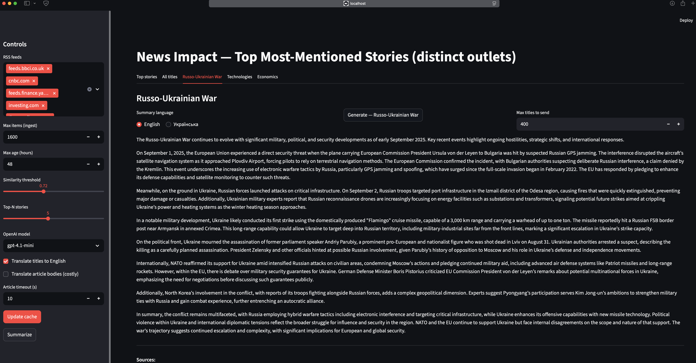
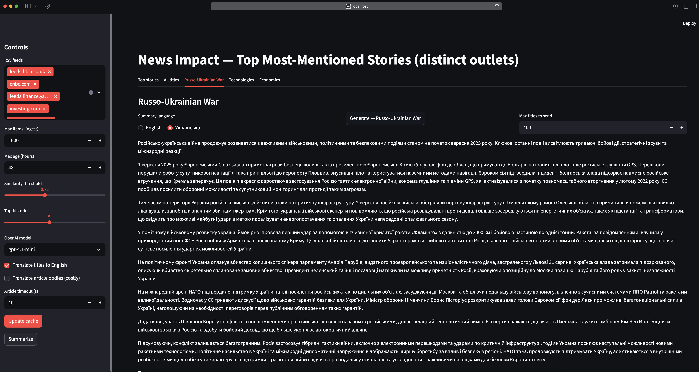
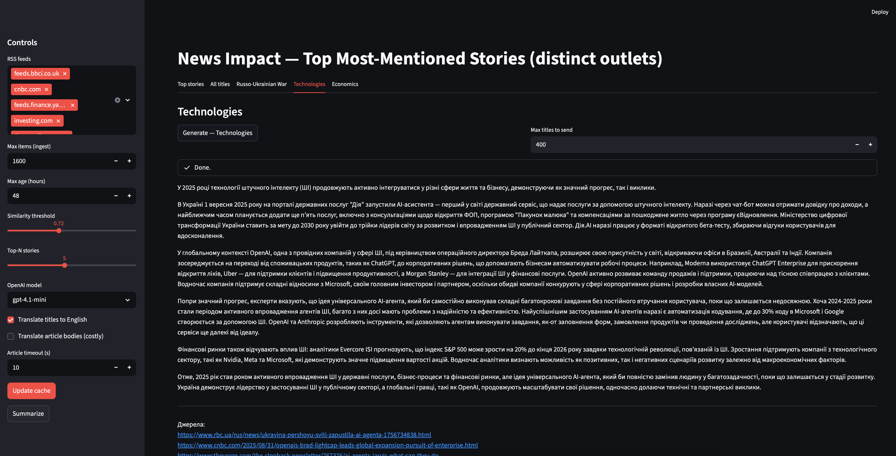
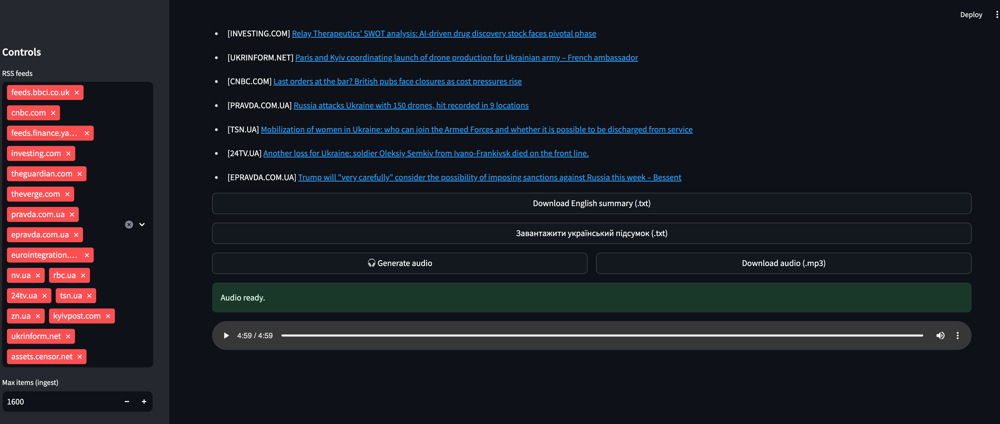

# Smart News
## Агрегатор і аналітик новин на GenAI
Vasyl Alba

---

## Мотивація
- Інформаційний шум, багато джерел
- Потрібні короткі, точні підсумки
- Фокус по темах і **складних умовах**
- Текст + **TTS** (аудіо)

---

## Цілі
1. Кеш новин із багатьох видань
2. Топ‑сюжети за **унікальними виданнями**
3. Підсумки з посиланнями (LLM)
4. Тематичні підсумки та **будь-які інші теми/умови**
5. Переклад EN/UK, **TTS**
6. Streamlit UI + Docker

---

## Дані та обробка
- RSS → `titles_cache.json`, `articles_cache.json`
- Ембеддинги: `all-MiniLM-L6-v2`
- Кластеризація: косинусна схожість
- Агрегація доменів: eTLD+1 (site → subdomain)
- Підсумки/переклад/TTS: OpenAI

---

## Інтерфейс
- **Top stories**: найчастіше згадані сюжети
- **All titles**: дерево site → subdomain
- **Topic tabs**: Russo-Ukrainian War, Technologies, Economics
- Перемикач мови, 🎧 TTS, завантаження .txt/.mp3

---

## Демонстрація (тема)


---



---



---

## Демонстрація (TTS)


---

## Виклики → Рішення
- RSS/404 → толерантний інжест, логування
- Парсинг HTML → евристики, ліміти
- Доменна агрегація → tldextract
- Витрати LLM → кеш/ідемпотентність

---

## Запуск
```bash
pip install -r requirements.txt
# .env: OPENAI_API_KEY=sk-...
streamlit run app/streamlit_app.py

docker build -t news-impact:cpu .
docker run --rm -p 8502:8501 --env-file .env -v "$(pwd)/out:/app/out" -v "$(pwd)/img:/app/img" news-impact:cpu
```

---

## Висновки
- Повний цикл аналізу новин з **тематичними підсумками** і **TTS**
- Підсумки для **будь-якої теми/умов**
- Збереження артефактів і повторне використання